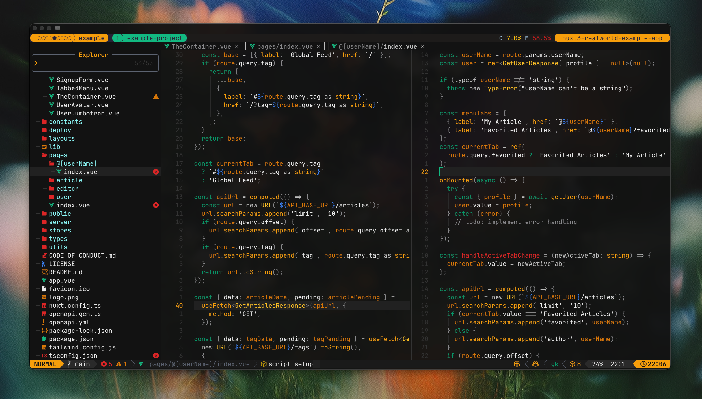

# Matteweave Tmux

A calm, minimal tmux theme built on top of [Synthweave](https://github.com/samharju/tmux-synthweave-theme) by [samharju](https://github.com/samharju).



## Installation (via TPM)

Add this line to your `.tmux.conf`:

```tmux
set -g @plugin 'aa-adibashraf/matteweave-tmux'
```

Then press prefix + I to install.

Manual installation

```bash
run-shell "~/.tmux/plugins/matteweave-tmux/matteweave.tmux"
```

License
MIT © 2025 Adib Ashraf
